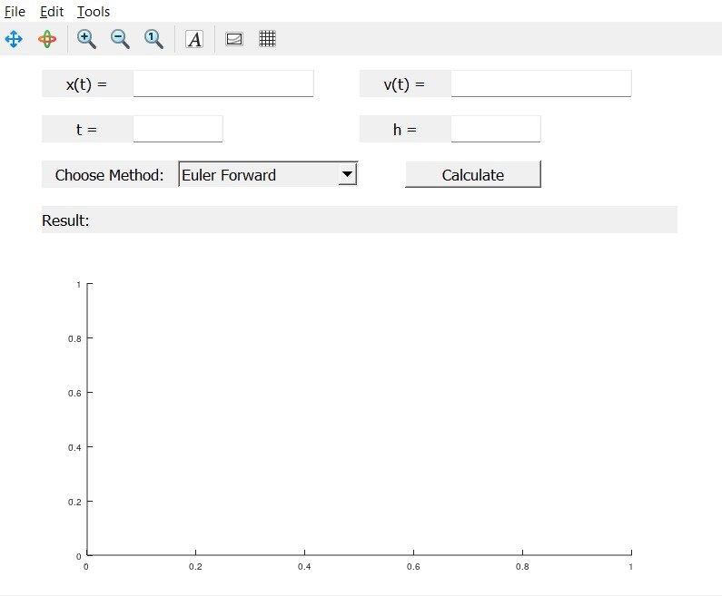
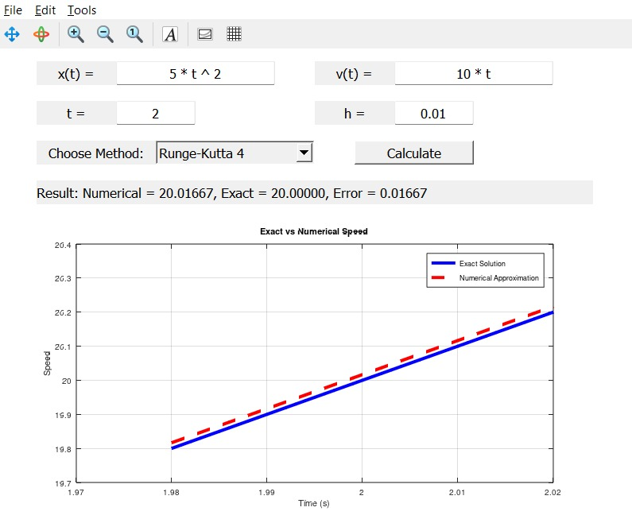

<!DOCTYPE html>
<html lang="en">
<head>
    <meta charset="UTF-8">
</head>
<body>

<h1>Radar Speed Gun Project 🚗</h1>

<h2>Overview</h2>

This project simulates a simple <strong>Radar Speed Gun</strong> using <strong>Numerical Methods</strong> to estimate the speed of a moving object based on its position function.

The numerical methods implemented are:

<ul>
    <li>Euler Forward</li>
    <li>Euler Backward</li>
    <li>Heun's Method</li>
    <li>Midpoint Method</li>
    <li>Runge-Kutta 4 (RK4)</li>
    <li>Adams-Bashforth</li>
    <li>Adams-Moulton</li>
</ul>

<h2>Features</h2>
<ul>
    <li>Input a position function <code>x(t)</code></li>
    <li>Input the exact velocity function <code>v(t)</code></li>
    <li>Select method from dropdown menu</li>
    <li>Set time <code>t</code> and step size <code>h</code></li>
    <li>See numerical result, exact result, and error</li>
    <li>Plot exact vs numerical solution</li>
</ul>

<h2>How to Run</h2>
<ol>
    <li>Install <a href="https://www.gnu.org/software/octave/">GNU Octave</a>.</li>
    <li>Clone the repository:
    <pre><code>git clone https://github.com/your-username/your-repo-name.git</code></pre></li>
    <li>Navigate to the project folder in Octave:
    <pre><code>cd path/to/your/project</code></pre></li>
    <li>Run the GUI:
    <pre><code>radar_speed_gui</code></pre></li>
</ol>

<h2>Example Test</h2>

<strong>Position function:</strong> <code>x(t) = 5 * t.^2</code>

<strong>Exact velocity:</strong> <code>v(t) = 10 * t</code>

At time <code>t = 2</code> with step size <code>h = 0.01</code>, Euler Forward should approximate around <strong>20.05 m/s</strong>, exact velocity is <strong>20 m/s</strong>.

<h2>Snapshots</h2>

<strong>1. GUI Main Window:</strong>

<!-- Add your GUI screenshot here -->

<strong>2. Plot Example:</strong>

<!-- Add your plot screenshot here -->

<h2>License</h2>

This project is licensed under the <a href="https://www.gnu.org/licenses/gpl-3.0.en.html">GNU General Public License v3.0</a>.

</body>
</html>
